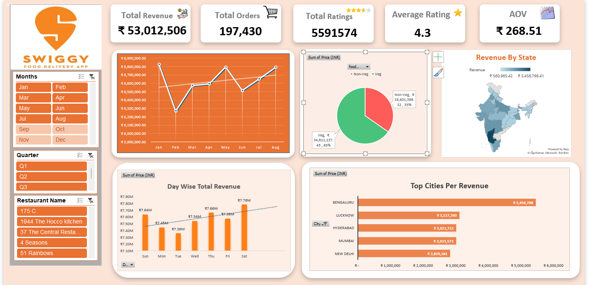

# Swiggy Sales Performance Dashboard 📊

## Key Insights & Business Recommendations

---

### 1. Weekend Revenue Dominance
**Insight:**  
Revenue peaks on **Saturday and Sunday**, indicating higher order volume during weekends.

**Recommendation:**  
Increase **delivery partner availability and promotional campaigns** on weekends to maximize order fulfillment and customer satisfaction.

---

### 2. Bengaluru Is the Top Revenue Contributor
**Insight:**  
Bengaluru generates the **highest revenue among all cities**, significantly outperforming others.

**Recommendation:**  
Prioritize **premium restaurant partnerships, faster delivery slots, and loyalty offers** in Bengaluru to further scale revenue.

---

### 3. Midweek Revenue Dip
**Insight:**  
Revenue drops noticeably during **Tuesday and Wednesday**.

**Recommendation:**  
Introduce **midweek discounts, free delivery offers, or corporate meal plans** to boost demand during low-performing days.

---

### 4. Strong Veg Preference
**Insight:**  
Vegetarian orders contribute a **larger share of total revenue** compared to non-veg orders.

**Recommendation:**  
Expand **veg-focused restaurant partnerships** and promote veg-exclusive combos to strengthen this high-demand segment.

---

### 5. Higher Value Non-Veg Orders
**Insight:**  
Despite fewer orders, non-veg items contribute significantly, indicating a **higher Average Order Value (AOV)**.

**Recommendation:**  
Create **premium non-veg bundles** and upsell add-ons such as sides and desserts to increase revenue per order.

---

### 6. Consistent Monthly Revenue Growth
**Insight:**  
Revenue shows a **steady upward trend across months**, with minor fluctuations.

**Recommendation:**  
Analyze high-performing months to **replicate successful marketing strategies** and maintain consistent growth.

---

### 7. Strong Customer Satisfaction
**Insight:**  
An average rating of **4.3** indicates high customer satisfaction and reliable service quality.

**Recommendation:**  
Promote **top-rated restaurants** and introduce a *“Highly Rated Near You”* section to increase customer trust and conversions.

---

### 8. High Order Volume With Stable AOV
**Insight:**  
A large number of orders combined with stable AOV suggests **strong repeat customer behavior**.

**Recommendation:**  
Launch **subscription-based loyalty programs** to improve customer retention and lifetime value.

---

### 9. Revenue Concentration in Metro Cities
**Insight:**  
Metro cities such as **Bengaluru, Hyderabad, and Mumbai** dominate overall revenue contribution.

**Recommendation:**  
Strengthen **hyperlocal marketing and delivery infrastructure** in metro cities while gradually expanding to Tier-2 markets.

---

### 10. State-wise Revenue Imbalance
**Insight:**  
Revenue contribution varies significantly across states.

**Recommendation:**  
Investigate **low-performing states** to identify issues related to restaurant density, pricing, or delivery efficiency.

---

### 11. Predictable Day-wise Demand Patterns
**Insight:**  
Revenue follows a **predictable day-wise pattern**, enabling demand forecasting.

**Recommendation:**  
Use these insights to **optimize delivery partner allocation and operational planning**.

---

### 12. Actionable Performance Monitoring
**Insight:**  
The dashboard enables quick identification of **high-performing and underperforming regions**.

**Recommendation:**  
Use this dashboard as a **weekly monitoring and decision-support tool** for business and operations teams.

---

## 🧠 Conclusion
This dashboard provides a comprehensive overview of sales performance, customer behavior, and regional trends, enabling **data-driven decision-making** to improve revenue, efficiency, and customer satisfaction.

